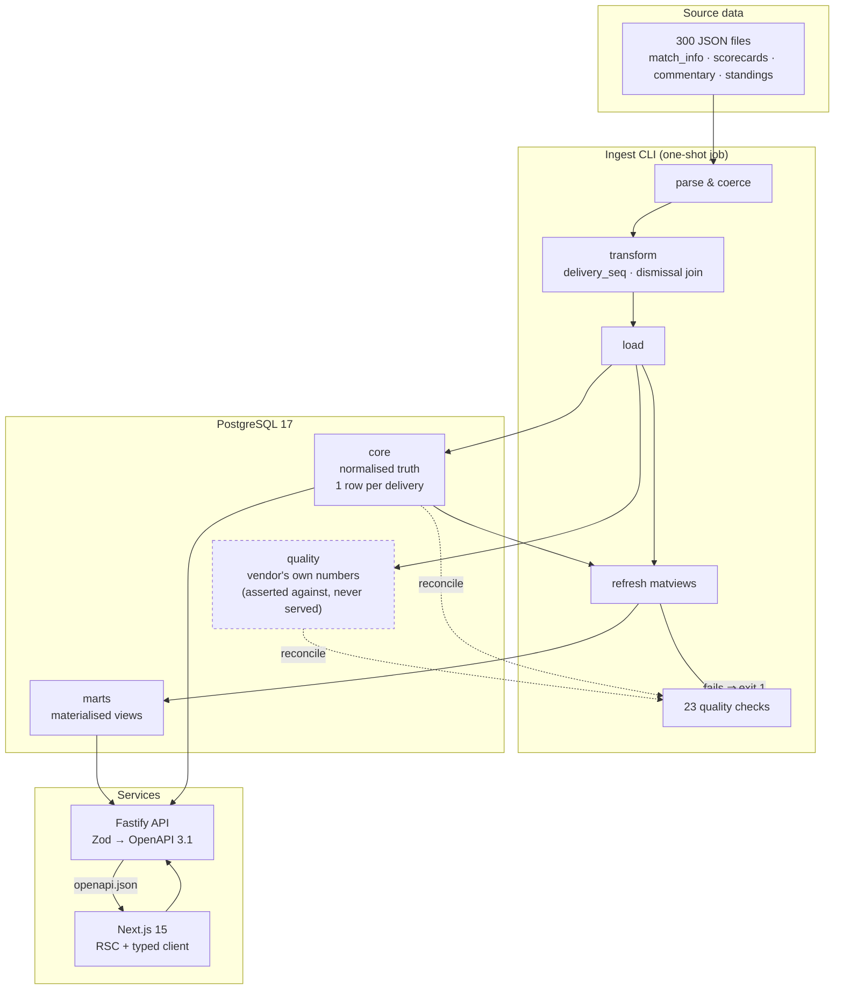
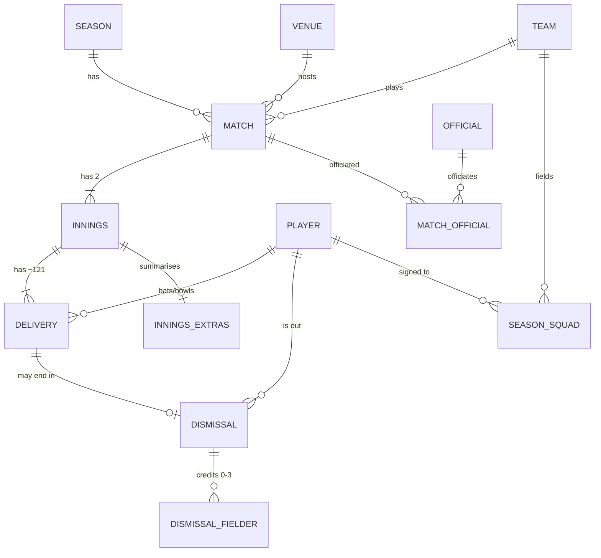
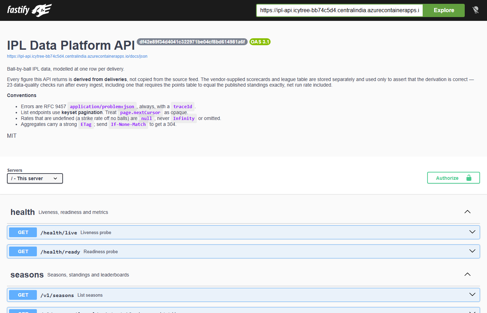
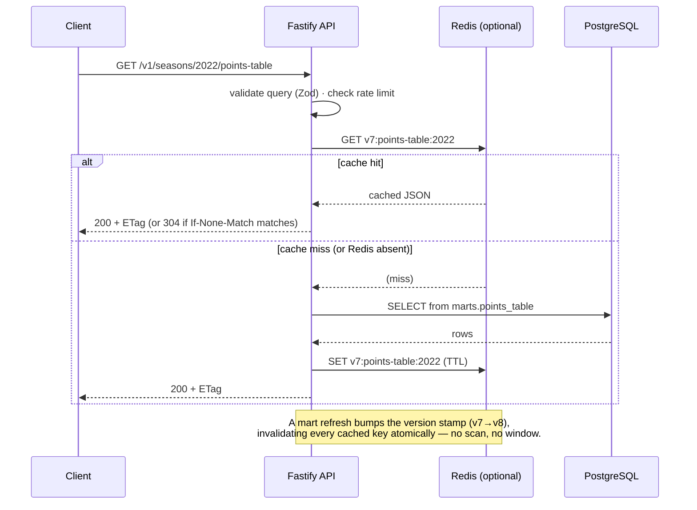
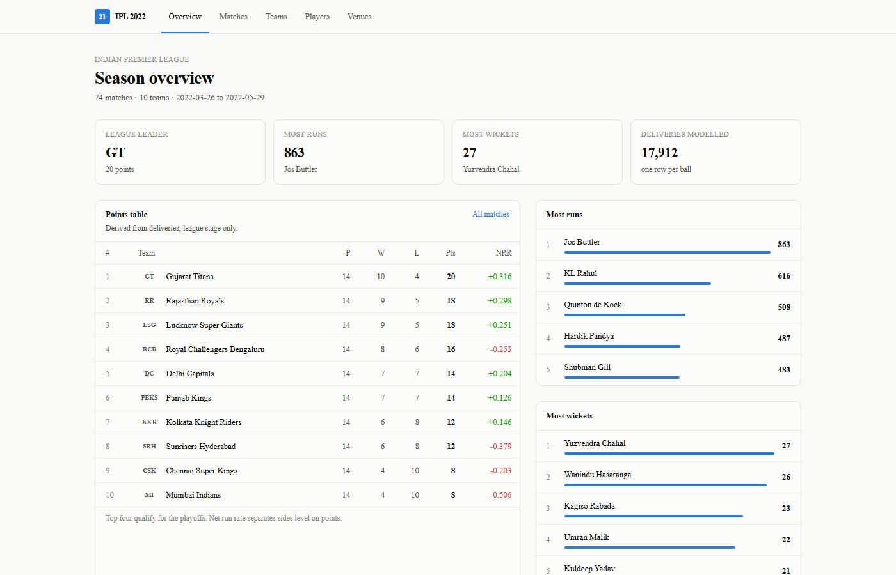
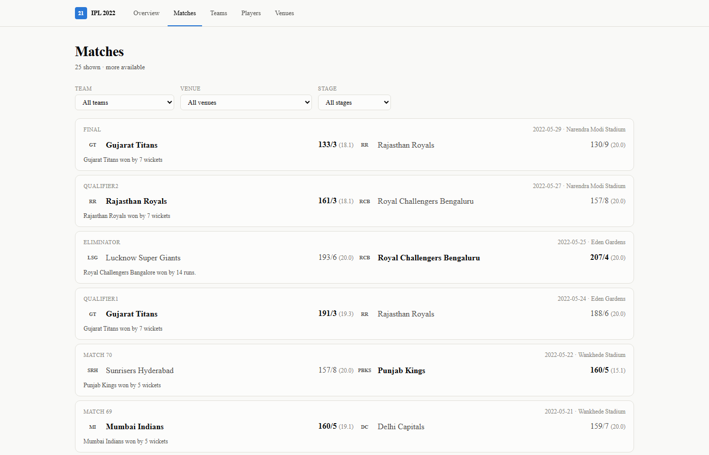
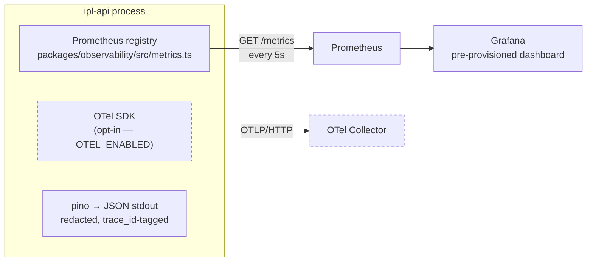
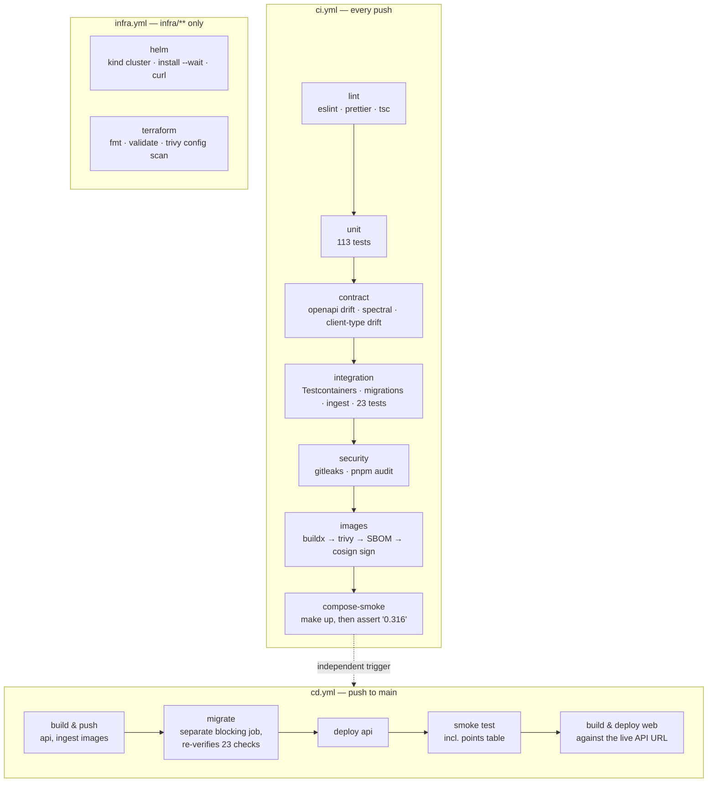

# IPL Data Platform

[](https://github.com/princegarg001/Duckworth/actions/workflows/ci.yml)
[](https://github.com/princegarg001/Duckworth/actions/workflows/cd.yml)
[](https://github.com/princegarg001/Duckworth/actions/workflows/infra.yml)
[](https://github.com/princegarg001/Duckworth/actions/workflows/codeql.yml)
[](LICENSE)
[](package.json)
[](tsconfig.base.json)

**[🌐 Live web app](https://ipl-web.icytree-bb74c5d4.centralindia.azurecontainerapps.io)** ·
**[📖 API docs](https://ipl-api.icytree-bb74c5d4.centralindia.azurecontainerapps.io/docs)** ·
**[📊 Grafana](https://ipl-grafana.icytree-bb74c5d4.centralindia.azurecontainerapps.io)** ·
**[💚 Health](https://ipl-api.icytree-bb74c5d4.centralindia.azurecontainerapps.io/health/ready)**

Ball-by-ball analytics for IPL 2022, modelled at **one row per delivery** —
17,912 of them — with every served figure derived from those deliveries and
reconciled against the published scorecards by an automated data contract.

The headline claim, and the one the whole design is arranged around:

> The points table this API serves is **computed from raw deliveries** and
> asserted equal to the official IPL 2022 standings — points, wins, losses, run
> and ball subtotals, and net run rate to three decimal places, for all ten
> teams. If any of that drifts, the ingest exits non-zero and the deploy stops.

```
┌──────────────────────────────────────────────────────────────────────────┐
│  74 matches · 148 innings · 17,912 deliveries · 912 dismissals           │
│  247 players · 10 teams · 6 venues · 31 officials                        │
│  23 data-quality checks · 136 tests · ingest in ~15s                     │
└──────────────────────────────────────────────────────────────────────────┘
```

---

## Submission checklist

Every item mapped to the exact thing that satisfies it — not a claim, a path.

| Requirement                     | Where                                                                                                                                                                    |
| ------------------------------- | ------------------------------------------------------------------------------------------------------------------------------------------------------------------------ |
| Architecture overview           | [Architecture](#architecture) below, plus [docs/architecture.md](docs/architecture.md) for the threat model                                                              |
| Local setup instructions        | [Quickstart](#quickstart) — three commands, verified in CI on every push                                                                                                 |
| Deployed setup instructions     | [Deployment](#deployment) — two independently-working paths (Azure, GCP), plus the Terraform for a real environment                                                      |
| Database schema / migrations    | [Data model](#data-model) below; source at [`packages/db/src/schema`](packages/db/src/schema), [`packages/db/migrations`](packages/db/migrations)                        |
| Dockerfiles & docker-compose    | [`apps/*/Dockerfile`](apps/api/Dockerfile) (multi-stage, distroless) · [`docker-compose.yml`](docker-compose.yml)                                                        |
| GitHub Actions workflows        | [`.github/workflows/ci.yml`](.github/workflows/ci.yml) · [`cd.yml`](.github/workflows/cd.yml) — see [CI/CD](#cicd)                                                       |
| Kubernetes configuration        | [`infra/helm/ipl-platform/`](infra/helm/ipl-platform) — a real chart, **applied** to a `kind` cluster on every CI run, not just linted                                   |
| OpenAPI documentation           | Live: [`/docs`](https://ipl-api.icytree-bb74c5d4.centralindia.azurecontainerapps.io/docs) · Source: [`packages/contracts/openapi.json`](packages/contracts/openapi.json) |
| Deployed application URLs       | [Live deployment](#deployment) — Web, API, docs and health, all reachable now                                                                                            |
| _Stretch:_ Terraform (IaC)      | [`infra/terraform/`](infra/terraform) — validated in CI, honestly marked as never applied to a live project                                                              |
| _Stretch:_ Kubernetes / Helm    | Done and proven — see the Kubernetes row above                                                                                                                           |
| _Stretch:_ Monitoring dashboard | [Observability](#observability) — Prometheus + Grafana, wired and running, not just instrumented                                                                         |

<details>
<summary>Table of contents</summary>

- [Quickstart](#quickstart)
- [Architecture](#architecture)
- [The dataset is not what the brief implies](#the-dataset-is-not-what-the-brief-implies)
- [Data model](#data-model)
- [Correctness](#correctness)
- [API](#api)
- [Frontend](#frontend)
- [Operations](#operations)
- [Observability](#observability)
- [CI/CD](#cicd)
- [Deployment](#deployment)
- [Security](#security)
- [Performance](#performance)
- [Trade-offs, and what I would do next](#trade-offs-and-what-i-would-do-next)
- [Repository layout](#repository-layout)
- [Documentation](#documentation)

</details>

---

## Quickstart

Three commands. The third takes a few minutes on a cold Docker cache.

```bash
git clone <this-repo> && cd ipl-platform
cp .env.example .env
make up
```

| What                            | Where                              |
| ------------------------------- | ---------------------------------- |
| Web application                 | http://localhost:3001              |
| API                             | http://localhost:3000              |
| Swagger UI                      | http://localhost:3000/docs         |
| Readiness (returns real detail) | http://localhost:3000/health/ready |

`make up` downloads the dataset, starts Postgres and Redis, runs the migrations,
ingests the season, refreshes the materialised views, runs the 23 quality
checks, and only then starts the API. If a check fails, the API never starts.

This exact sequence runs in CI on every push (`ci.yml` → `compose-smoke`), which
is how the claim above stays true rather than being true on the day it was
written.

<details>
<summary>Running without Docker</summary>

```bash
pnpm install
make db          # postgres + redis only
make ingest      # migrate, load, refresh, verify
pnpm dev         # api on :3000, web on :3001
```

</details>

<details>
<summary>Watching it work — Prometheus + Grafana</summary>

```bash
make observability   # adds Prometheus, Grafana and the OTel collector
```

Opens a pre-loaded dashboard at http://localhost:3002 (no login needed) —
request rate and latency, event-loop lag, cache hit ratio, and the same
data-quality and row-count numbers the ingest itself checks, all live. See
[Observability](#observability) below for what each panel means and why.

</details>

---

## Architecture



The unusual piece is the **`quality` schema**. The dataset ships pre-computed
scorecards and an official league table. Serving those would mean publishing
numbers we did not compute; discarding them would mean throwing away the only
independent check available. So they are loaded into a quarantined schema and
used for exactly one thing: proving that what we derived from ball-by-ball
matches what the provider says. Everything the API returns comes from `core`.

**Stack:** Node 22 · TypeScript (strict, `noUncheckedIndexedAccess`) · Fastify 5
· Drizzle · PostgreSQL 17 · Redis · Next.js 15 · Tailwind · Recharts ·
pnpm workspaces + Turborepo · Vitest + Testcontainers · Docker (distroless) ·
GitHub Actions · Helm · Terraform · OpenTelemetry · Prometheus + Grafana.

---

## The dataset is not what the brief implies

The assignment points at a zip. It is **not** the Cricsheet or Kaggle CSV shape
most IPL work assumes — it is 300 JSON files from a commercial sports API,
covering a single season, in fourteen directories of varying usefulness.

So the first thing built was a profiler, not a schema. Designing from the
actual bytes surfaced eight defects that a schema drawn from the brief would
have silently absorbed:

| #   | What the source does                                                                                                         | Why it matters                                                                                         | How it is handled                                                                                                                                                                                                          |
| --- | ---------------------------------------------------------------------------------------------------------------------------- | ------------------------------------------------------------------------------------------------------ | -------------------------------------------------------------------------------------------------------------------------------------------------------------------------------------------------------------------------- |
| 1   | `result_type` **contradicts its own `status_note` in 49 of 74 matches**                                                      | Two thirds of the season would be labelled "won by wickets" when it was won by runs                    | Field ignored entirely. The margin kind is derived from _which innings the winner batted in_ — a side that bats first and wins, wins by runs. Agrees with the prose on 74/74. [`result.ts`](packages/domain/src/result.ts) |
| 2   | `(over, ball)` is **not unique** — 729 collisions                                                                            | Any sort or pagination by it silently drops or repeats deliveries                                      | Monotonic `delivery_seq`, assigned at transform time, is the ordering key everywhere                                                                                                                                       |
| 3   | `over` is **0-indexed on ball events, 1-indexed on over summaries**                                                          | Off-by-one in every phase split                                                                        | `overend` entries are never read for their over; they are not deliveries at all                                                                                                                                            |
| 4   | `commentaries` mixes **three event kinds** — 17,001 `ball`, 911 `wicket`, 2,837 `overend`                                    | Counting all three inflates the ball count by 16%                                                      | Only `ball` and `wicket` are deliveries; a `wicket` _is_ one                                                                                                                                                               |
| 5   | Of 912 dismissals, **exactly one has no delivery** (a retired hurt)                                                          | Modelling dismissals as a column on `delivery` forces that row to be invented, dropped, or misattached | `dismissal` is its own table with a **nullable** `delivery_id`. R Ashwin's retired-out _does_ sit on a ball; the two retirements are not the same case                                                                     |
| 6   | Three deliveries have run components that **don't sum to their total** ("5 no ball")                                         | Extras reconciliation fails by 9 runs                                                                  | Residual recovered as byes by elimination — not off the bat (batting reconciles), not the no-ball penalty (bowling reconciles) — and reported on every run                                                                 |
| 7   | Two deliveries list the **striker twice** instead of striker + non-striker                                                   | Non-striker unresolvable                                                                               | Recovered from the previous pair at the crease; the pair only changes on a wicket or between overs                                                                                                                         |
| 8   | Umpires arrive as **one string** whose third entry contains a comma inside its parenthetical: `"… , Nitin Menon(India, TV)"` | `split(',')` invents a fourth official named `TV)` — 74 times                                          | Split on top-level commas only, then parse role and country. Whitespace-normalised so `Menon(India)` and `Menon (India)` are one person                                                                                    |

Two more the vendor gets wrong that we report rather than absorb: one innings
whose extras components sum to 12 against its own stated total of 11 (the
ball-by-ball agrees with the total), and 11 matches with an empty `win_margin`
recovered from the prose.

Four directories are **deliberately not ingested**, and the ingest prints why on
every run: `match_wagon_wheel` contains no wagon-wheel coordinates despite the
name, `match_live_details` is a stale mid-match snapshot, and the `*_stats`
directories are pre-aggregated leaderboards that are derivable — used as
validation, never stored.

---

## Data model

Grain is **one row per delivery**. Everything else is derived and rebuildable.



Four schemas, four different guarantees:

- **`staging`** — raw landed rows, disposable.
- **`core`** — the normalised truth, aggressively constrained.
- **`marts`** — ten materialised views, refreshed `CONCURRENTLY`.
- **`quality`** — the vendor's numbers, asserted against and never served.

Things worth opening the schema for:

**Generated columns.** `extra_runs`, `is_wide`, `is_noball`, `is_legal_ball` and
`counts_as_ball_faced` are computed _by Postgres_, so no code path — ingest,
backfill, or a future writer — can produce a row that disagrees with itself.

**Constraints that make bad rows unstorable.** A winner must be a participant. A
decided match has both a winner and a margin, or neither. A delivery cannot be
both a wide and a no-ball. `credits_bowler` must equal `bowler_id IS NOT NULL`,
so a run-out can never become a bowler's wicket. Only a `retired_hurt` may exist
without a delivery.

**`total_runs` is stored, not generated.** Three deliveries have components that
don't sum; innings totals reconcile on the reported total, so it wins, and a
quality check reports the discrepancy rather than a generated column making
those three rows unstorable.

**No partitioning.** 17,912 delivery rows. Partitioning here would be
resume-driven development. The threshold to revisit is roughly 50M rows, or when
a single-season scan exceeds the p99 budget.

---

## Correctness

This is the part worth checking. 136 tests across three layers, and none of them
assert "returns 200" as the interesting property.

### The data contract — 23 checks, run after every ingest

Every check is a SQL query returning _offending rows_, so a failure arrives with
the rows that caused it. They gate the pipeline: a failure exits non-zero, and in
compose and Helm the API never starts.

```
✓ every_match_has_two_innings          ✓ batting_runs_reconcile
✓ no_over_exceeds_six_legal_balls      ✓ batting_balls_faced_reconcile
✓ innings_within_allotted_overs        ✓ batting_boundaries_reconcile
✓ delivery_sequence_is_contiguous      ✓ bowling_balls_reconcile
✓ striker_is_not_bowler                ✓ bowling_runs_conceded_reconcile
✓ wicket_count_within_innings          ✓ bowling_wickets_reconcile
✓ dismissal_belongs_to_its_innings     ✓ innings_extras_reconcile
✓ bowler_credit_matches_dismissal_kind ✓ innings_runs_reconcile
✓ only_retired_hurt_lacks_a_delivery   ✓ innings_wickets_reconcile
✓ match_winner_played_the_match        ✓ points_table_matches_published_standings
✓ no_orphan_players_in_deliveries      ! vendor_extras_components_self_consistent (warn)
✓ every_match_has_officials
✓ delivery_components_sum_to_total

✓ 23 data-quality checks passed, 1 warning
```

The one warning is deliberate: it flags a defect in the _source_, not in our
derivation, and is `severity: warn` so it stays visible on every run without
blocking a deploy. It starts failing if it ever changes.

### Net run rate, validated against the real table

NRR is where cricket data platforms quietly go wrong. Three rules, all verified:

1. **A side bowled out is charged its full 20-over quota**, not the overs it
   actually faced — otherwise taking the tenth wicket would _hurt_ your NRR.
2. **League stage only.** Including the four playoff matches moves all four
   qualifiers and reconciles with nothing.
3. **Retired hurt is not a wicket lost**, so it cannot trigger rule 1 spuriously.

Computed from deliveries, compared to the published standings:

| #   | Team | P   | W   | L   | Pts | NRR (ours = official) | Runs for | Overs for |
| --- | ---- | --- | --- | --- | --- | --------------------- | -------- | --------- |
| 1   | GT   | 14  | 10  | 4   | 20  | **+0.316**            | 2339     | 278.1     |
| 2   | RR   | 14  | 9   | 5   | 18  | **+0.298**            | 2464     | 279.2     |
| 3   | LSG  | 14  | 9   | 5   | 18  | **+0.251**            | 2355     | 279.1     |
| 4   | RCB  | 14  | 8   | 6   | 16  | **−0.253**            | 2268     | 275.4     |
| 5   | DC   | 14  | 7   | 7   | 14  | **+0.204**            | 2341     | 266.0     |
| 6   | PBKS | 14  | 7   | 7   | 14  | **+0.126**            | 2343     | 270.1     |
| 7   | KKR  | 14  | 6   | 8   | 12  | **+0.146**            | 2223     | 268.1     |
| 8   | SRH  | 14  | 6   | 8   | 12  | **−0.379**            | 2197     | 261.3     |
| 9   | CSK  | 14  | 4   | 10  | 8   | **−0.203**            | 2288     | 280.0     |
| 10  | MI   | 14  | 4   | 10  | 8   | **−0.506**            | 2217     | 273.2     |

Ten of ten, to three decimals — see
[`nrr.test.ts`](packages/domain/src/__tests__/nrr.test.ts) and the
`points_table_matches_published_standings` check.

Independent spot-checks that also come out right: Jos Buttler 863 runs with 4
hundreds (Orange Cap), Yuzvendra Chahal 27 wickets (Purple Cap), Quinton de
Kock's unbeaten 140.

### Tests

| Layer                                  | Tool                        | What it proves                                                                                                                                                                                                                                                 |
| -------------------------------------- | --------------------------- | -------------------------------------------------------------------------------------------------------------------------------------------------------------------------------------------------------------------------------------------------------------- |
| **Unit** — 113 tests, 99.5% statements | Vitest                      | Pure cricket logic: over arithmetic is base-6 (`17.4 + 0.2 = 18.0`), a strike rate off zero balls is `null` not `Infinity`, run-outs never credit a bowler, the umpire parser never invents `TV)`                                                              |
| **Integration** — 23 tests             | Vitest + **Testcontainers** | Real Postgres 17, real migrations, real ingest run as a subprocess, driven through `app.inject()`. Asserts internally consistent scorecards, cursor pagination that neither repeats nor skips across all 74 matches, ETag/304, and the points table row by row |
| **E2E**                                | Playwright + axe            | Four user flows plus an accessibility pass                                                                                                                                                                                                                     |

Nothing is mocked in the integration layer, deliberately. A mocked database
cannot tell you that a generated column disagrees with a check constraint, that
a matview refreshes concurrently, or that `(over, ball)` collides.

---

## API

OpenAPI 3.1 at `/openapi.json`, Swagger UI at `/docs`. **26 endpoints.**

```
GET  /health/live                     process only — checks no dependency
GET  /health/ready                    db, cache, migrations, mart age, data quality
GET  /metrics                         Prometheus (RED + USE)

GET  /v1/seasons                          GET  /v1/matches
GET  /v1/seasons/{year}/points-table      GET  /v1/matches/{id}
GET  /v1/seasons/{year}/leaders           GET  /v1/matches/{id}/deliveries
GET  /v1/teams                            GET  /v1/matches/{id}/worm
GET  /v1/teams/{id}                       GET  /v1/matches/{id}/manhattan
GET  /v1/teams/{a}/head-to-head/{b}       GET  /v1/matches/{id}/partnerships
GET  /v1/players                          GET  /v1/venues
GET  /v1/players/{id}                     GET  /v1/venues/{id}/profile
GET  /v1/players/{id}/batting             GET  /v1/analytics/compare
GET  /v1/players/{id}/bowling             GET  /v1/analytics/venues
GET  /v1/players/{id}/phase-splits        GET  /v1/analytics/head-to-head
GET  /v1/players/{id}/form
POST /internal/refresh-marts              service-token guarded
```

<p align="center">
  
  <br/>
  <sub>Live: <a href="https://ipl-api.icytree-bb74c5d4.centralindia.azurecontainerapps.io/docs">/docs</a> — every schema on this page is generated, none hand-written.</sub>
</p>

### The contract cannot drift

```mermaid
flowchart LR
    Z["Zod schemas<br/>packages/contracts"] -->|"one source"| O["OpenAPI 3.1<br/>openapi.json"]
    O -->|"openapi-typescript"| T["Generated TS types<br/>api-types.ts"]
    T -->|"openapi-fetch"| F["Frontend client<br/>apps/web"]

    O -.->|"CI: regenerate, diff, fail on drift"| CHK1{{"matches committed copy?"}}
    T -.->|"CI: regenerate, diff, fail on drift"| CHK2{{"matches committed copy?"}}
    CHK1 -.->|no| X1["❌ build fails here"]
    CHK2 -.->|no| X2["❌ frontend typecheck fails here"]

    style X1 fill:#4a1c1c,stroke:#e5484d
    style X2 fill:#4a1c1c,stroke:#e5484d
```



CI regenerates the document and **fails if it differs from the committed copy**,
then regenerates the frontend's types and fails if _those_ differ. Remove a
field the UI reads and the **frontend's typecheck** breaks — in the pull request
that removed it, not in production.

### Request lifecycle — a cache hit vs. a cache miss



### Conventions

**RFC 9457 `application/problem+json`** on every failure, with field-level paths:

```json
{
  "type": "https://ipl-platform.dev/errors/validation-failed",
  "title": "Validation failed",
  "status": 422,
  "detail": "Validation failed for the request querystring.",
  "instance": "/v1/matches?limit=500",
  "traceId": "ffe8cbf5-3cde-4934-8939-4714d34fa540",
  "errors": [
    {
      "path": "querystring.limit",
      "message": "Number must be less than or equal to 100"
    }
  ]
}
```

A response that fails its _own_ schema is reported as 500, not as a client
error — that is our bug, not the caller's.

**Keyset pagination** by default. `OFFSET 40000` makes Postgres walk and discard
40,000 rows. The cursor is opaque base64 and documented as such, which keeps the
sort key an implementation detail. `hasMore` comes from fetching `limit + 1`
rather than a second `COUNT`.

**Undefined rates are `null`, never `Infinity`.** A batter who faced no ball has
no strike rate. `Infinity` sorts to the top of every leaderboard.

**Cache invalidation by version stamp.** Keys are namespaced by the current mart
version (`v7:leaders:2022:runs`), and a refresh bumps that integer — so one
write invalidates every cached aggregate atomically, with no key scanning and no
window where a stale derivation is served.

**Rate metrics carry a qualification floor.** Without one, the best strike rate
of any season belongs to a number eleven who faced two balls.

---

## Frontend

Eight screens, server-rendered, with the charts streaming in behind `<Suspense>`
so the scorecard never waits on them.

<p align="center">
  
  
  <br/>
  <sub>Live: <a href="https://ipl-web.icytree-bb74c5d4.centralindia.azurecontainerapps.io">/</a> and <a href="https://ipl-web.icytree-bb74c5d4.centralindia.azurecontainerapps.io/matches">/matches</a></sub>
</p>

| Route                        | Content                                                              |
| ---------------------------- | -------------------------------------------------------------------- |
| `/`                          | Points table, season leaders, headline stats                         |
| `/matches`                   | Filterable, cursor-paginated fixture list                            |
| `/matches/[id]`              | Full scorecard, worm chart, manhattan chart, partnerships, officials |
| `/matches/[id]/deliveries`   | Virtualised ball-by-ball                                             |
| `/teams` · `/teams/[id]`     | Standings, head-to-head, season results                              |
| `/players` · `/players/[id]` | Search, career record, phase splits, recent form                     |
| `/venues`                    | Scoring and toss profile per ground                                  |

**The URL is the state.** Every filter and cursor lives in the query string, so
a filtered view is shareable and the back button steps through filter changes.

**Loading, empty and error states** are shared components used everywhere, with
a route-segment error boundary offering a real retry and surfacing the API's
`traceId`. In development, append `?__state=empty` (or `loading`/`error`) to see
them on demand.

**Charts** follow a validated method: the form is chosen by the data's job
(cumulative score over time → line; runs per over → bars; three ordered phases →
bars, not a radar). The three-slot categorical palette clears colour-vision
separation gates in both light and dark mode. **No chart has a second y-axis.**
Every chart carries a _Table_ toggle rendering the same numbers as a real
`<table>` — the accessibility path, and the relief mechanism for the one series
colour that sits under 3:1 on the light surface.

---

## Operations

**Liveness checks nothing external; readiness checks everything.** If liveness
checked the database, one database blip would fail every replica's probe, kill
them all simultaneously, and turn a recoverable incident into an outage with a
cold start at the end of it.

`/health/ready` returns substance:

```json
{
  "status": "ok",
  "version": "1.0.0",
  "commit": "c1e166a",
  "uptimeSeconds": 8241,
  "checks": {
    "database": { "status": "ok", "latencyMs": 3 },
    "cache": { "status": "ok", "latencyMs": 1 },
    "migrations": { "status": "ok", "applied": 1 },
    "martFreshness": {
      "status": "ok",
      "lastRefresh": "2026-08-29T09:12:04Z",
      "ageSeconds": 312
    },
    "dataQuality": {
      "status": "ok",
      "failing": 0,
      "lastRun": "2026-08-29T09:12:03Z"
    }
  }
}
```

That last check is the unusual one: readiness reports whether the data is
_trustworthy_, not merely whether the database answers.

**Graceful shutdown.** `SIGTERM` → stop accepting → drain in flight → close the
pool → exit 0. Without it, every rolling deploy returns 502s to whoever was
mid-request. `terminationGracePeriodSeconds` is set above the drain timeout so
the kubelet cannot `SIGKILL` mid-drain.

**Metrics** are labelled by route _template_, never resolved path — one time
series per match id would make the metrics backend the most expensive component
in the system.

---

## Observability

Three pillars, and every one of them is a running system, not a slide.



```bash
make observability   # docker compose --profile observability up -d
```

Opens onto **a dashboard that is already populated** — datasource and panels
are provisioned on boot from files in the repository
([`infra/grafana/provisioning`](infra/grafana/provisioning)), so there is no
setup wizard between cloning this repository and seeing real numbers move.

| Where                  | URL                                            |
| ---------------------- | ---------------------------------------------- |
| Grafana                | http://localhost:3002 (anonymous admin access) |
| Prometheus             | http://localhost:9090                          |
| Raw metrics (any time) | http://localhost:3000/metrics                  |

This same stack is also **deployed and live**, not just runnable locally —
`scripts/deploy-azure.sh` builds and deploys Prometheus and Grafana as two
more Container Apps against the real API, the same way it deploys everything
else. See [Live deployment](#deployment) for the URL; Grafana's credentials
there are shared separately rather than committed to this file.

**The dashboard, row by row** — every panel below queries a metric the API
already emits; nothing in Grafana is a second source of truth:

| Row                                       | Panels                                                                                          |
| ----------------------------------------- | ----------------------------------------------------------------------------------------------- |
| **RED** (rate, errors, duration)          | Request rate by route · 5xx error rate · latency p50/p95/p99                                    |
| **USE** (utilisation, saturation, errors) | Event-loop lag p50/p99 · backend dependency latency by operation · cache hit ratio              |
| **Data platform trust**                   | Materialised-view staleness · data-quality checks currently failing · live row counts by entity |
| **Process**                               | CPU time · resident memory                                                                      |

Two of those rows are the generic ones any service needs. The third is the
one that matters for _this_ service: **the dashboard can show a reviewer, live,
that the platform's headline claim still holds** — `data_quality_check_status`
and `core_rows_current` are read from the same tables `/health/ready` and the
ingest's own 23 checks use, not a synthetic demo metric.

<p align="center">
  
  
  <br/>
  
  
  <br/>
  <sub>Four panels from the live dashboard — captured with <a href="apps/web/scripts/capture-screenshots.mjs"><code>apps/web/scripts/capture-screenshots.mjs</code></a>, not staged.</sub>
</p>

**Metrics exposed** (Prometheus format, `/metrics`, always on regardless of the
observability profile):

| Metric                          | Type      | Labels                | Source                                                               |
| ------------------------------- | --------- | --------------------- | -------------------------------------------------------------------- |
| `http_requests_total`           | Counter   | `method,route,status` | Every response, via an `onResponse` hook                             |
| `http_request_duration_seconds` | Histogram | `method,route,status` | Same hook, `reply.elapsedTime`                                       |
| `db_query_duration_seconds`     | Histogram | `operation`           | The real timings behind `/health/ready`'s own five checks            |
| `cache_operations_total`        | Counter   | `result`              | Redis hit/miss/error counters, sampled at scrape time                |
| `mart_staleness_seconds`        | Gauge     | `mart`                | `core.mart_refresh`, sampled at scrape time                          |
| `core_rows_current`             | Gauge     | `entity`              | Live `count(*)` across the eight entities in the README's own banner |
| `data_quality_check_status`     | Gauge     | `check,status`        | Latest row per check in `quality.check_result`                       |

That table is deliberately this specific. An earlier pass through this wiring
had `db_pool_connections` defined but never populated — `postgres.js` does not
expose pool internals publicly, and reaching into its private queues for a
demo metric would have been exactly the kind of fragile guess this project
argues against elsewhere. It was removed rather than shipped as a permanently
empty panel; `db_query_duration_seconds` and `core_rows_current` were wired to
real queries instead of staying aspirational.

**Traces** are OpenTelemetry auto-instrumentation (HTTP, Fastify, `pg`,
`ioredis`), OTLP-exported, off by default (`OTEL_ENABLED=false`) so a plain
`make up` costs nothing extra. `docker-compose.yml` ships a real
`otel-collector` service in the same profile so the wiring is exercisable, not
theoretical — it logs received spans to its own stdout
(`docker compose logs otel-collector`); swapping the exporter for Datadog or
Honeycomb is a config change in [`infra/otel/collector.yaml`](infra/otel/collector.yaml),
not an application change.

**Logs** are structured JSON everywhere including local development, with
config-based redaction (auth headers, cookies, tokens, `DATABASE_URL`) so a
debug dump cannot leak a secret, and a `traceId` on every request-completion
line for correlation with an active trace.

**Honestly not done:** logs are not yet trace-linked (`trace_id`/`span_id`
injected into each log line so a log and a trace can be pivoted between); no
external vendor (Datadog, Honeycomb) is wired — only the OTLP path that would
make doing so a config change.

---

## CI/CD

Every gate below actually fails the build. Three separate workflows, not one
monolith — `ci.yml` on every push, `infra.yml` only when `infra/**` changes
(no point spinning up a kind cluster for a route-handler edit), `cd.yml` on
every push to `main`.



Actions are **pinned by SHA**, not by tag. Job permissions are least-privilege.
Superseded runs are cancelled. CodeQL runs `security-extended` on a weekly
schedule, separately from all three above.

**CD authenticates with a service principal, scoped to one resource group —
not the subscription.** `AZURE_CREDENTIALS` is a client-secret credential
created once with
`az ad sp create-for-rbac --role contributor --scopes /subscriptions/<id>/resourceGroups/ipl-platform`
(see the comment in `cd.yml`). A leaked credential can touch this project and
nothing else.

The deploy is gated, not blind: migrations run as a **separate job that
re-verifies the 23 checks** before anything else moves, the API is smoke-tested
directly against its live URL — including that the points table still reads
`0.316` — and only then is the web image built (against that real, live API
hostname) and deployed. Azure Container Apps has no native traffic-split
primitive the way Cloud Run does, so `containerapp update` replaces the active
revision directly rather than staging a canary; Container Apps keeps the prior
revision, and the workflow prints the exact rollback command on failure.

Migrations are **expand-then-contract**: add a column, backfill, switch reads,
drop in a _later_ release. A destructive change in the same deploy that starts
using it cannot be rolled back.

---

## Deployment

Being precise about this, because it is the easiest place in a submission to
imply more than is true.

| Component           | Status                                                                                                        |
| ------------------- | ------------------------------------------------------------------------------------------------------------- |
| `docker compose up` | **Works**, verified in CI on every push against a clean clone                                                 |
| Azure deploy        | **Live now** — the URLs above, deployed by `scripts/deploy-azure.sh` and kept live by `cd.yml` on every push  |
| Helm chart          | **Validated by applying it** — CI spins a kind cluster, installs, waits for rollout, curls the API            |
| Cloud Run deploy    | **Scripted and reproducible** (`scripts/deploy-cloudrun.sh`) — the alternative path, not the one that is live |
| Terraform           | **Written and machine-checked** (`fmt`, `validate`, config scan in CI). **Never applied to a live project**   |

**Live deployment (Azure Container Apps):**

| Service | URL                                                                                                                                                                      |
| ------- | ------------------------------------------------------------------------------------------------------------------------------------------------------------------------ |
| Web     | https://ipl-web.icytree-bb74c5d4.centralindia.azurecontainerapps.io                                                                                                      |
| API     | https://ipl-api.icytree-bb74c5d4.centralindia.azurecontainerapps.io                                                                                                      |
| Docs    | https://ipl-api.icytree-bb74c5d4.centralindia.azurecontainerapps.io/docs                                                                                                 |
| Health  | https://ipl-api.icytree-bb74c5d4.centralindia.azurecontainerapps.io/health/ready                                                                                         |
| Grafana | https://ipl-grafana.icytree-bb74c5d4.centralindia.azurecontainerapps.io — credentials shared separately, not committed here (gitleaks would fail the build on it anyway) |

```mermaid
flowchart TB
    subgraph acr["Azure Container Registry"]
        IMGS["api · web · ingest<br/>prometheus · grafana"]
    end

    subgraph env["Container Apps environment · ipl-env"]
        API["ipl-api<br/>external ingress"]
        WEB["ipl-web<br/>external ingress"]
        ING["ipl-ingest<br/>Job — run-once, exits"]
        PROM["ipl-prometheus<br/>internal ingress only"]
        GRAF["ipl-grafana<br/>external ingress"]
    end

    PG[("PostgreSQL Flexible Server<br/>SSL required")]

    IMGS -.->|pulled at deploy| API & WEB & ING & PROM & GRAF
    ING -->|migrate → load → refresh → verify| PG
    API --> PG
    WEB -->|"build-time NEXT_PUBLIC_API_URL"| API
    PROM -->|"scrapes /metrics<br/>every 5–15s"| API
    GRAF -->|"queries<br/>(https:// — Container Apps<br/>redirects plain http even internally)"| PROM

    User(("Reviewer's browser")) --> WEB
    User --> API
    User --> GRAF

    style ING stroke-dasharray: 4 4
    style PROM fill:#1a2332,stroke:#4a6a9e
```

<!-- LIVE_URLS -->



Two things about this shape are deliberate rather than incidental: the ingest
job **contains no host volume** — Container Apps Jobs have nowhere to mount
one — so the dataset ships inside the image itself, and the tag that ran a
given load _is_ the exact bytes that were loaded. And Grafana talks to
Prometheus over `https://`, not the more obvious `http://`, because Container
Apps' ingress enforces TLS even for traffic that never leaves the environment
— a plain HTTP request gets a 301 that Grafana's own proxy does not follow,
which surfaced as an opaque "400: error querying Prometheus" with no detail
in Grafana's own logs until traced by hand.

### Deploying

Two paths, and the difference between them is deliberate.

**Azure Container Apps — the deployed path.**

```bash
az login
./scripts/deploy-azure.sh
```

Provisions a resource group, an Azure Container Registry, a PostgreSQL
Flexible Server, and a Container Apps environment; builds every image locally
with `docker buildx --platform linux/amd64` and pushes to ACR (`az acr build`
— ACR Tasks — is blocked on Azure for Students subscriptions, so this is a
deliberate workaround, not the default path on a subscription without that
restriction); runs the ingest as a **Container Apps Job** — the direct
analogue of the one-shot job this pipeline was designed around — and only
deploys the API once that job has succeeded. It finishes by building and
deploying Prometheus and Grafana the same way — see
[Observability](#observability).

Container Apps was chosen over App Service because it scales to zero, provides
managed TLS, and has a job primitive. App Service needs a paid tier for Linux
containers and has no equivalent to a run-once job.

**Cloud Run + Neon — the equivalent on GCP.**

```bash
export PROJECT_ID=your-gcp-project
export DATABASE_URL='postgres://…@ep-xxx.neon.tech/ipl?sslmode=require'
./scripts/deploy-cloudrun.sh
```

Roughly five minutes. The script enables the APIs, creates the image
repository, builds `linux/amd64` images, runs the ingest as a Cloud Run Job —
which migrates, loads, refreshes the marts and runs the 23 quality checks,
failing the deploy if any of them fails — deploys the API, smoke-tests it
(including that the points table still reads `+0.316` for GT), then builds the
web image **against the API's real URL** and deploys it.

That last ordering is not incidental: Next inlines `NEXT_PUBLIC_API_URL` at
build time, so the web image cannot be built until Cloud Run has assigned the
API a URL. CORS starts pinned to an unroutable origin and is narrowed to the
web URL once it exists, so there is never a window in which the API is open.

The ingest image **contains the dataset**. A Cloud Run Job has no host
directory to mount, so the 33MB of source JSON is baked in at build time — the
image tag therefore identifies the exact bytes that were loaded, and
`docker run <image> all` is self-contained.

**Terraform — for a real environment.**

```bash
terraform -chdir=infra/terraform/envs/prod apply -var="image_tag=$(git rev-parse --short HEAD)"
```

Provisions a private-IP Cloud SQL instance with PITR, a VPC connector,
Artifact Registry with immutable tags, and both Cloud Run services with secrets
injected from Secret Manager by reference. That is the right shape for
production and costs ~$25/month; the script above is the right shape for a
link on a submission. Both are in the repository, and only one of them has
been run.

**Continuous deployment** is wired in `cd.yml` and needs two repository
secrets (`GCP_WIF_PROVIDER`, `GCP_DEPLOY_SERVICE_ACCOUNT`) plus two variables
(`GCP_REGION`, `ARTIFACT_REGISTRY`). It authenticates by Workload Identity
Federation rather than a service-account key, runs migrations as a separate
blocking job, deploys the API at 0% traffic, smoke-tests the revision
directly, canaries at 10%, and only then promotes.

---

## Security

- Config parsed with Zod at boot; the process **exits** on anything invalid,
  including `CORS_ORIGINS="*"` or a missing internal token in production.
- CORS is an explicit allowlist. Helmet, HSTS, body limits, request timeouts,
  Redis-backed rate limiting.
- `statement_timeout` on the connection — a backstop for the query nobody
  remembered to bound, which is by definition the one that takes the site down.
- **Parameterised queries only.** An ESLint rule bans string-concatenated SQL.
  The two places needing a dynamic identifier resolve it through a closed
  lookup keyed by a Zod enum; no client string ever reaches the query text.
- Containers: distroless, non-root, read-only root filesystem, `cap_drop: ALL`,
  Trivy gate on HIGH/CRITICAL, SBOM, cosign keyless signatures.
- Secrets: Secret Manager via ExternalSecrets. Nothing sensitive in any values
  file. gitleaks in CI. Terraform has no `db_password` variable _at all_ — the
  credential is generated into Secret Manager and referenced by name.
- Default-deny NetworkPolicy with an explicit egress allowlist.

Threat model and what would change for a multi-tenant deployment:
[`docs/architecture.md`](docs/architecture.md).

---

## Performance

Measured on the development machine (Postgres 17 in Docker, warm cache):

| Operation                                                             | Result                                   |
| --------------------------------------------------------------------- | ---------------------------------------- |
| Full ingest — 300 files → 17,912 deliveries → 10 matviews → 23 checks | **~15 s** end to end                     |
| Delivery load throughput                                              | ~1,300 rows/s (transactional, per match) |
| Migrations, empty → full schema                                       | 322 ms                                   |
| Mart refresh, all ten, `CONCURRENTLY`                                 | 320 ms total                             |
| `/v1/seasons/2022/points-table`                                       | ~3 ms                                    |
| `/v1/matches/{id}` full scorecard                                     | ~25 ms, fixed query count                |

The scorecard number is the interesting one: a naive implementation issues
1 + 2 + 2×4 = eleven round trips per match and grows with innings. This one
issues six, each covering all innings at once, and is constant in that dimension.

---

## Trade-offs, and what I would do next

- **No partitioning on `core.delivery`** (17,912 rows). It would be
  resume-driven development at this size. Revisit around 50M rows, or when a
  single-season scan exceeds the p99 budget.
- **Marts refresh in batch** after ingest, which is correct for a completed
  season. Live match feeds would want incremental refresh or a CDC → streaming
  aggregate path; the `mart_refresh` version stamp is already the invalidation
  hook that would need.
- **Vendor IDs are primary keys.** They are stable and make re-ingest idempotent
  for free, at the cost of coupling to one provider's id space. A second data
  source would mean surrogate keys and a crosswalk table. See ADR 0003.
- **No authentication.** The dataset is public and the API is read-only. Adding
  it means OIDC plus per-key rate limits; the plugin seams are already in place
  at `apps/api/src/plugins/`.
- **Redis is optional and barely earns its place** at this data size. It is
  wired in to exercise the version-stamped invalidation design, and the API
  runs correctly without it.
- **Single season.** The schema is season-scoped throughout (`season_id` on
  matches, marts keyed by season), so multi-season is an ingest change rather
  than a remodel — but franchise renames across eras (Delhi Daredevils →
  Capitals, Kings XI → Punjab Kings) would then need the alias table this
  dataset did not require.
- **`exactOptionalPropertyTypes` is off.** It mostly fights library typings
  rather than catching real bugs; `strict` and `noUncheckedIndexedAccess` are on.
- **k6 load testing is not included.** The latency numbers above are single-shot
  measurements, not a load profile, and are labelled as such.

---

## Repository layout

```
apps/
  api/         Fastify service — routes → repositories, boundaries lint-enforced
  ingest/      CLI: migrate · load · refresh · verify
  web/         Next.js 15 App Router
packages/
  domain/      Pure cricket logic. No I/O — enforced. 113 tests, 99.5% coverage
  db/          Drizzle schema, migrations, matview SQL, the 23 checks
  contracts/   Zod schemas + generated openapi.json
  observability/ pino, OpenTelemetry, Prometheus
  config/      Zod env parsing that exits on invalid config
infra/
  helm/        Chart proven by a kind job in CI
  terraform/   GCP modules — validated in CI, never applied
  k8s/kind/    CI cluster config
  prometheus/  Scrape config for the api's own /metrics
  grafana/     Provisioned datasource + the dashboard in this README
  otel/        Local collector config for the tracing profile
docs/
  architecture.md · data-model.md · runbook.md · adr/
```

## Documentation

- [Architecture and threat model](docs/architecture.md)
- [Data model — the eight source defects in detail](docs/data-model.md)
- [Runbook — reingest, refresh, rollback, what the alerts mean](docs/runbook.md)
- Decision records: [0001 Fastify](docs/adr/0001-fastify-over-nest.md) ·
  [0002 Drizzle](docs/adr/0002-drizzle-over-prisma.md) ·
  [0003 vendor IDs as keys](docs/adr/0003-vendor-ids-as-primary-keys.md) ·
  [0004 deriving the result kind](docs/adr/0004-derive-result-from-innings.md) ·
  [0005 the quality schema](docs/adr/0005-quality-schema.md) ·
  [0006 keyset pagination](docs/adr/0006-keyset-pagination.md)
