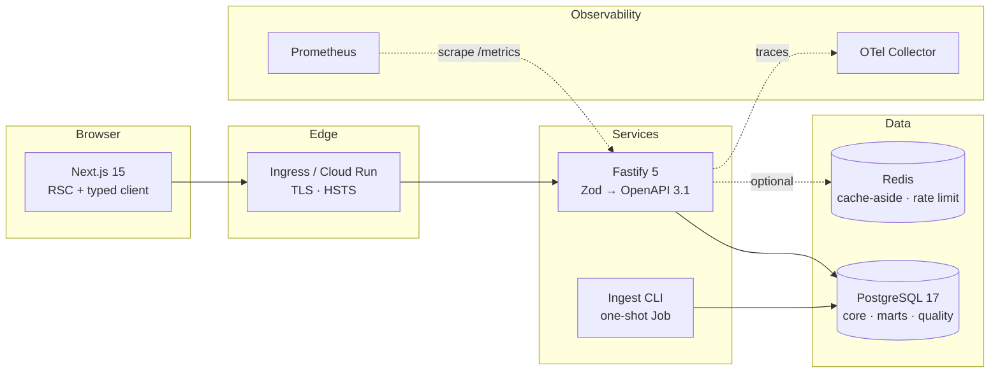

# Architecture

## Shape



Redis is drawn dashed because it is genuinely optional: with no `REDIS_URL` the
API serves uncached and falls back to a per-process rate limiter. A service that
cannot start without its cache has turned a nice-to-have into a hard dependency.

---

## Layering

```
routes/        HTTP only — bind a schema, call down, choose a status code
   ↓
repositories/  SQL. The only layer that knows a database exists
   ↓
packages/domain   Pure functions. No I/O of any kind
```

This is **enforced, not documented.** `eslint-plugin-boundaries` fails the build
if a route imports a repository's internals or a repository imports a route, and
a `no-restricted-imports` rule stops `packages/domain` importing `postgres`,
`drizzle-orm`, `fastify`, `ioredis`, or anything from `node:fs`/`node:net`.

A layering rule that lives only in a README is one that has already been broken
somewhere.

The domain package being pure is what makes it testable to 99.5% with 113 fast
tests, and it is where every cricket rule lives — so "does a run-out credit the
bowler?" has exactly one answer in the codebase.

---

## Request path

1. **Correlation.** `x-request-id` is accepted from the caller or minted, echoed
   on the response, and attached to every log line and the OTel span.
2. **Rate limit.** Redis-backed when available. `/health` and `/metrics` are
   exempt — a scraper hitting the limit would make the service look down.
3. **Validation.** Zod, via the type provider. Failures become RFC 9457 422s
   carrying field paths.
4. **Cache.** Aggregates go through cache-aside keyed by mart version, then get
   a strong `ETag`; a matching `If-None-Match` returns 304 with no body.
5. **Query.** Explicit projections, parameterised, under a connection-level
   `statement_timeout`.
6. **Response.** Serialised against the same Zod schema. A response that fails
   its own schema is a **500** — that is our bug, not the caller's.

---

## Why the analytics live in materialised views

The alternative is computing career records and points tables per request.

Ten views, refreshed `CONCURRENTLY` after ingest, all rebuildable from `core` at
any time. The data's cadence justifies it: a completed season changes when the
ingest runs and at no other moment, so recomputing a season rollup on every
request is work that produces the same answer every time.

The trade-off is staleness, made explicit rather than hidden:
`core.mart_refresh` records when each view was last built, `/health/ready`
reports the oldest one, and a Prometheus gauge alerts above 24 hours.

For live match feeds this would be the wrong design — that wants incremental
refresh or a CDC → streaming aggregate path. The `mart_refresh` version stamp is
already the invalidation hook that would need.

---

## Cache invalidation

The one design decision here worth defending.

Every cache key is namespaced by the current mart version: `v7:leaders:2022:runs`.
`core.mart_refresh.version` increments on every refresh.

So a refresh invalidates **every cached aggregate atomically** by changing one
integer. No key scanning, no `KEYS *`, no per-key deletion, and — the important
part — no window in which a client can read a value derived from data that has
since been replaced. Stale entries simply become unreachable and expire on their
own TTL.

The alternative, deleting keys by pattern after a refresh, is O(keyspace), not
atomic, and leaves exactly that window open.

---

## Threat model

### What is exposed

| Surface | Exposure | Control |
|---|---|---|
| `GET /v1/*` | Public, read-only | Rate limit, body limit, request timeout, `statement_timeout` |
| `POST /internal/*` | Public route, token-gated | Shared secret from Secret Manager; **required** in production or the process refuses to start |
| `/docs`, `/openapi.json` | Public | Intentional. The data is public |
| `/metrics` | Should not be public | Scraped in-cluster; not exposed through the Ingress rules |
| PostgreSQL | Private IP only | VPC connector; no public address |
| Redis | In-cluster | NetworkPolicy egress allowlist |

### What is trusted

- **The dataset.** Read-only, from a known location, hashed on ingest. Its
  *contents* are explicitly not trusted — the 23 checks exist because the source
  is wrong in eight identified ways.
- **The cluster network**, to the extent the NetworkPolicy allows: DNS,
  Postgres, Redis, the OTLP collector. Nothing else, including the cloud
  metadata service.

### What is not trusted

- **All client input.** Validated by Zod at the edge; nothing reaches SQL
  unparameterised. The only two places building SQL from a variable resolve it
  through a closed lookup keyed by a Zod enum — an unlisted value cannot reach
  the query, and the type checker rejects a missing key.
- **Our own responses.** Serialised against the declared schema; a mismatch is
  a 500, not a leak of whatever shape the code happened to produce.

### Known gaps, and what they would cost

| Gap | Why it is acceptable here | What closing it needs |
|---|---|---|
| **No authentication** | Public dataset, read-only API | OIDC via `@fastify/jwt`, per-key rate limits. The plugin seams exist at `apps/api/src/plugins/` |
| **No per-tenant isolation** | Single tenant | Row-level security on `core`, tenant claim in the token, tenant in the cache key namespace |
| **No audit log** | Nothing mutates | An append-only table on write paths, which would first require write paths |
| **No WAF** | Rate limiting and body limits cover the realistic abuse | Cloud Armor or equivalent in front of the load balancer |
| **Secrets rotate manually** | Single environment | ExternalSecrets `refreshInterval` is already 1h; rotation needs a scheduled Secret Manager version bump |

### Supply chain

Lockfile committed and `--frozen-lockfile` everywhere. Dependabot grouped
weekly. `pnpm audit --audit-level=high`, gitleaks, and CodeQL on every push.
Images are distroless, non-root, read-only rootfs, `cap_drop: ALL`, scanned by
Trivy with a HIGH/CRITICAL gate, shipped with an SBOM and **signed with cosign
keyless** — the signature is bound to the workflow's OIDC identity, so there is
no signing key to leak.

GitHub Actions are pinned by commit SHA rather than tag, because a tag is
mutable and `@v4` is an invitation.

---

## Scaling

Where this design would bend first, in order:

1. **Delivery volume.** 17,912 rows today. At ~50M, range-partition
   `core.delivery` by `season_id` — every mart already filters on it.
2. **Matview refresh time.** 320ms for all ten. At multi-season scale, refresh
   only the seasons that changed, which needs the views split per season or
   partitioned.
3. **Read throughput.** The API is stateless and scales horizontally; Postgres
   becomes the constraint first. Read replicas for the mart queries, since they
   tolerate replica lag by construction — they are already stale by design.
4. **Ingest.** Currently one transaction per match, ~1,300 deliveries/second.
   `COPY` into staging plus a set-based transform would be roughly an order of
   magnitude faster and is the obvious move if the source ever grows to
   multi-season backfills.
